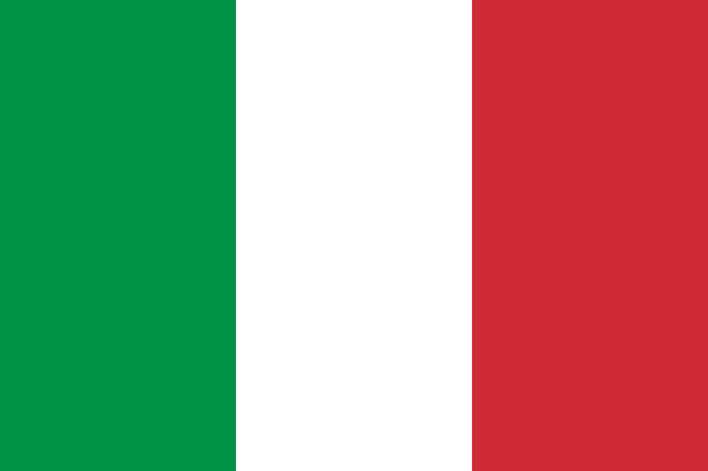
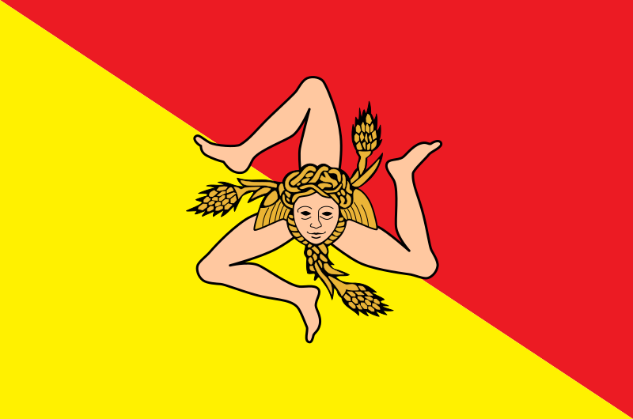

# 👋 Ciao, sono Flavio!  

🌍 This README is available in:&nbsp;&nbsp;[** English**](README.md)&nbsp;&nbsp;·&nbsp;&nbsp;**[ Italian](README.it.md)**&nbsp;&nbsp;·&nbsp;&nbsp;[ Sicilian](README.sc.md)

---

Sviluppatore e graphic designer siciliano. Animo le idee attraverso programmazione e design. Amo questi mondi e imparare sempre cose nuove.  

Appassionato di computer e grafica fin da piccolo, dai biglietti di auguri che realizzavo agli esperimenti con strumenti digitali. Col tempo ho sviluppato sia le mie competenze di programmazione sia quelle di design, concentrandomi sempre sull’imparare facendo.  

Lavoro a progetti freelance per diversi clienti, tra cui [**PowerUp**](powerupasd.it), un’associazione sportiva con due palestre in Sicilia, occupandomi di identità visiva, siti web, contenuti per i social media e materiali stampati.  

---

## 🛠 Competenze e strumenti  

**Programmazione:** C, C++, Python, HTML, CSS  
**Design e strumenti visivi:** Figma, Adobe Illustrator, Inkscape, branding, layout, creazione di contenuti  

---

## 📫 Rimaniamo in contatto  

📧 Email: [flaviolanzafame@proton.me](mailto:flaviolanzafame@proton.me)  
💼 LinkedIn: [in/flavio-lanzafame](https://linkedin.com/in/flavio-lanzafame)  
🎨 Behance: [@lanzafameflavio](https://www.behance.net/lanzafameflavio)  
📸 Instagram: [@lanzafame_flavio](https://instagram.com/lanzafame_flavio)
